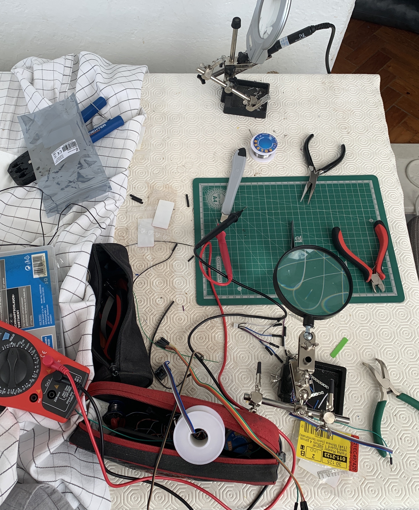
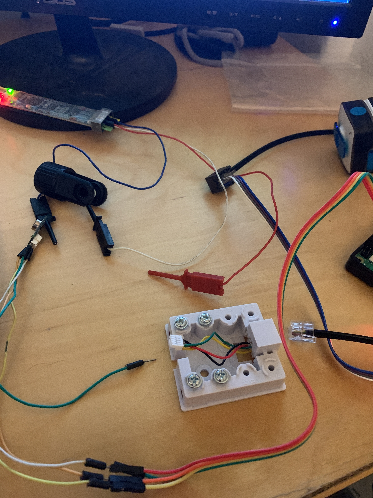
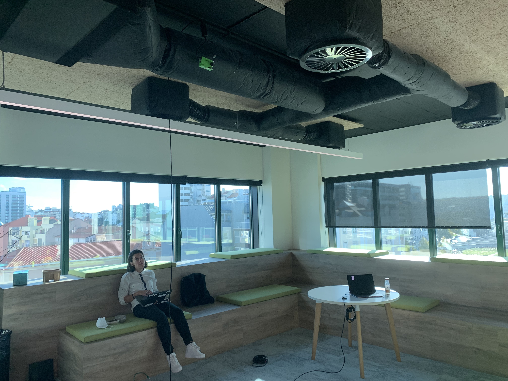
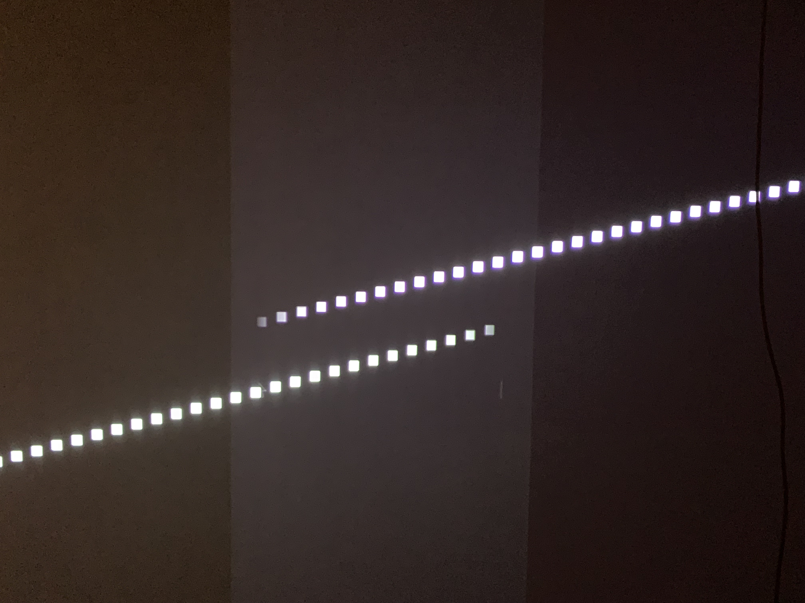
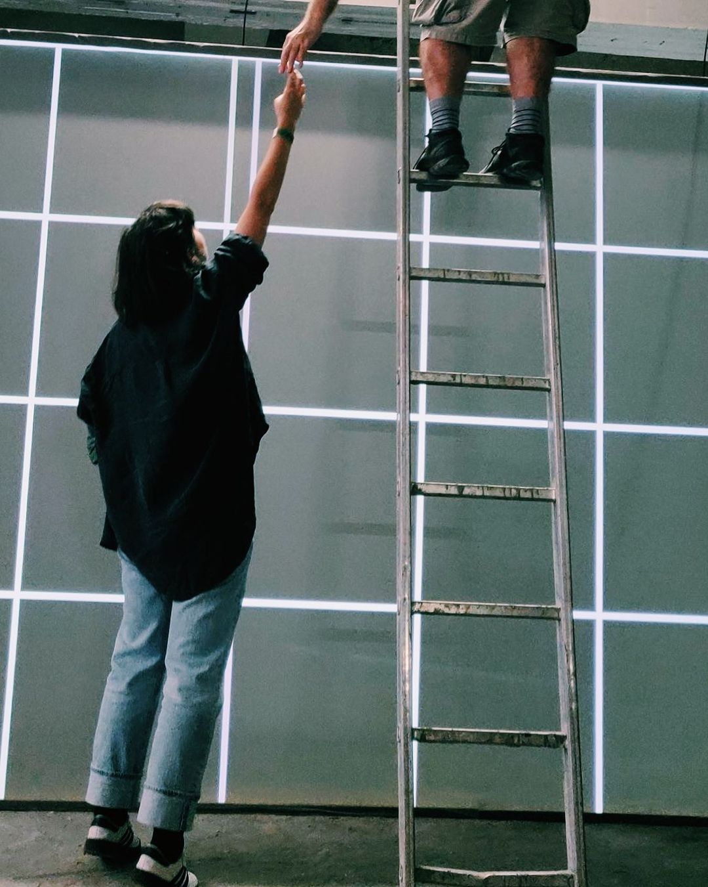
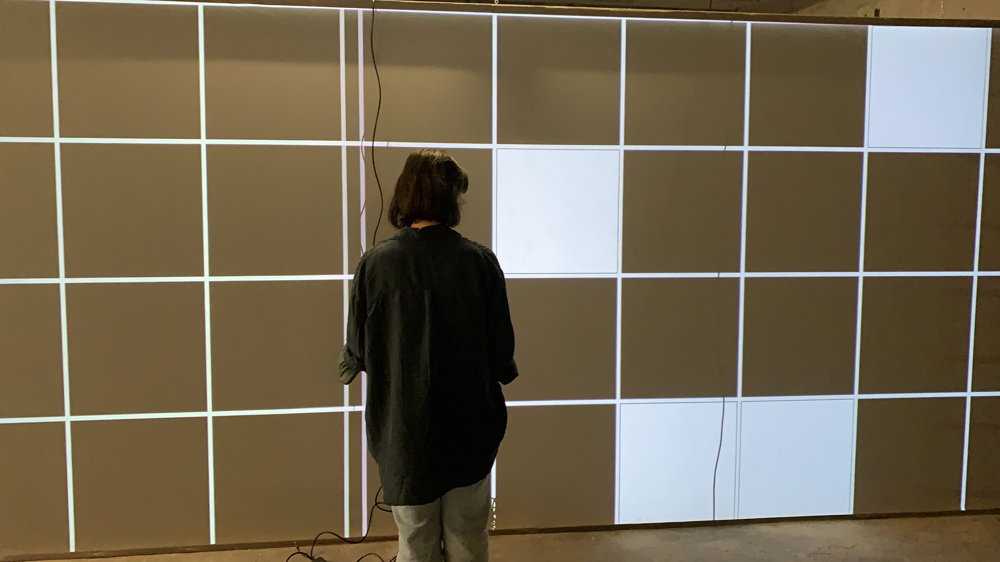
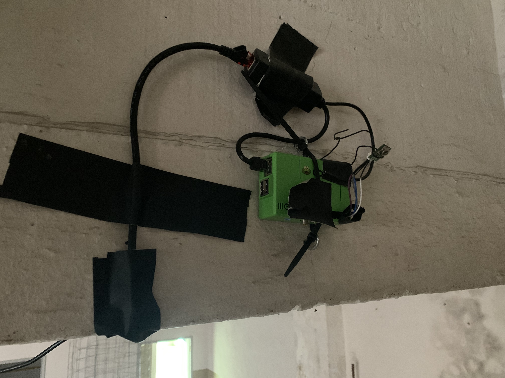
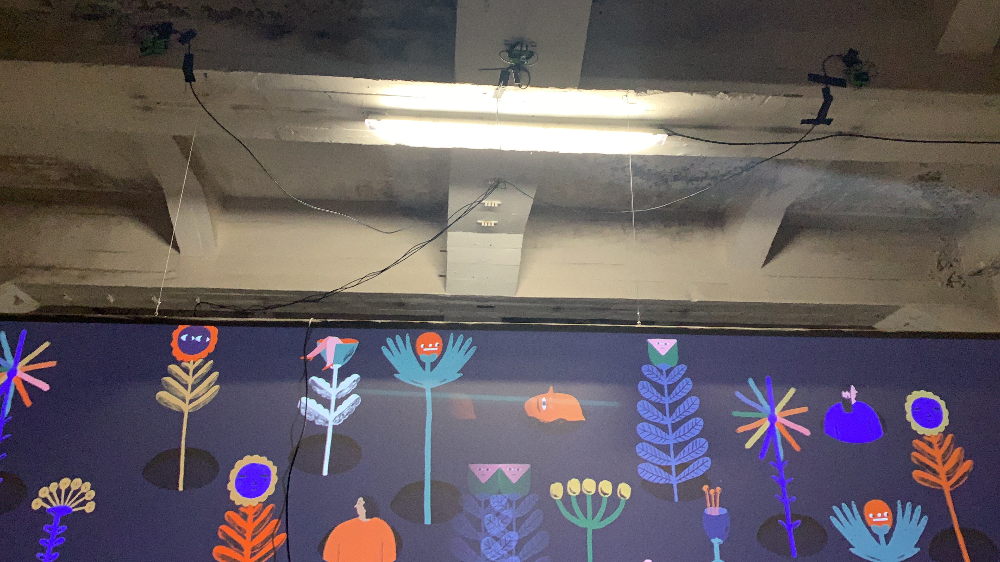
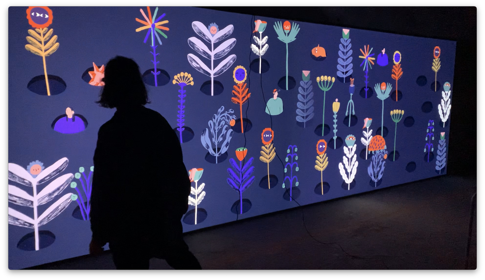

# The Wallflowers (The making of)

I’m really happy with the result of our work at Iminente as part of Truphone's sponsorship of Iminente 2021.
I’ve already wrote somewhere else about the wonderful and inspiring work we did with the kids of PER11. This is about creating the installation you hopefully had the chance to experience at the festival. Of course, this isn't the whole story, just my story.

## Beginnings 

Iminente challenged us to create a piece with [Mariana, A Miserável](https://marianaamiseravel.com/) joining art and technology.

Mariana came up with a few concepts for the piece. We immediately locked on to one idea and iterated over it until we figured we couldn’t make it work to the full potential we had in mind so Mariana had to come up with a new idea overnight. 
That turned out to be a good thing as the new idea was even better.

We wanted to make it interactive and explored a few options. Buttons and the like wouldn’t work at the scale of the piece we imagined and broke the magic, we wanted an immersive piece driven by presence. After a few more options like cameras, kinects and floor sensors we agreed on heat as the means of interaction. The piece would be driven by body heat.

## A plan

After imagining the result it was time to figure out the path. First thing was figuring out how to deal with heat. Full fledged FLIR cameras were way off budget and simple presence detectors are too crude for the interaction we wished for. Somewhere there in the middle I found the Omicron D6T temperature low res cameras. They’re not too expensive, had good precision and area coverage specifications and have simple I2C interfaces I knew I could hook up to pretty much anything with an expansion header. 
Next was choosing the main computing platform for the piece. The answer was obviously raspberry pi 4, with 4 I2C buses and 2 4k hdmi ports. Kit was ordered, including a roll of cable, raster plugs and pins. 

Next was choosing the software stack. The workshop with the kids was all about Scratch cause we really wanted them to do things by themselves and not just try to copy dry code from a whiteboard (mega kudos to [Joana](https://www.linkedin.com/in/fullstackdevjoanacorreia) who drove the workshop) but having something working reliably 24/4 (the festival is 4 days, no need for 7) interacting with hardware and such was a job for something else. After a little back and forth we settled on Processing. Processing is a language/framework to help artists do digital art and seemed perfect for this, lots of features for getting things on screen and animating them and there’s a version for the raspberry Pi which includes serial and I2C interfaces. 

## Pins and needles

Software prototypes were quickly assembled, Joana set to work with Mariana on getting the art animated in processing and I got to work on connecting sensors to raspberry and software to read the sensors. And there the trouble started. Not with the software, I2C support in Processing for Raspberry was straightforward, but with the hardware. The sensor data sheet mention JST raster plugs so I ordered the last 7 plugs of that model in Portugal (have I mentioned the hardware supply squeeze ?) and pins and thought no more about it. At least until the kit arrived and I noticed the sensors are really small and use the smallest JST plugs and 2mm solderless pins. 2mm solderless pins are crimped onto a specific wire gauge using a specific crimping tool. Needless to say, I had neither so after several iterations of using magnifying lens, pliers, tweezers, thermo-retractable sleeves and eventually solder I got to a point were I could produce GoodEnough plugs. For a few days, 2mm pins were the bane of my existence. 

Next step was going from short pigtails to a more realistic 10m cable with plugs at both ends. The host couldn’t even enumerate the bus so it was time to break out the oscilloscope and go analogue, only to confirm there was too much unshielded cable and connectors for I2C. I managed to get it somewhat working by lowering the I2C clock to about 2kHz, snail pace by I2C standards but fast enough to transmit 64 bytes every few seconds. The plan was moving along, it was just a matter of connecting the other two sensors to bus 2 and 3 on the raspberry Pi. But surprise, bus 2 and 3 are running at the regular 100kHz, way too fast for the setup we need. A couple of hours of googling and multiple reboots didn’t turn up a way to change the secondary buses clock, and the long cables and connectors setup was brittle to begin with. Time for plan B. But first, figure out plan B!

The sensors needed short I2C cables so the solution was raspberry Pis nearer to the sensors. Sourcing more Pis on short notice was easier than expected as friends have drawers full of them from previous lives but now our simple Processing sketch turned into a distributed system with 1 display Pi and 3 sensor Pis. We had no plans for power near the sensors so that meant another trip to the shop to get Power over Ethernet kit and 10m Ethernet cables. With the physical part sorted it was time to hack up a python bottle to expose the sensor readings via HTTP. That half page script quickly evolved to include the person detection logic which almost became an AI piece but engineering good sense prevailed and a simple gradient against recorded baseline temperatures was enough. 

## All together now

With the sensors assembled, and an ugly processing sketch with a calibration grid instead of Mariana’s art in hand we commandeered the all hands space at the Lisbon office to do a final test of The Piece. Turned out the sensor specs were slightly too optimistic but nothing major, we were ready to start assembling the piece on location. 

That’s when we met the awesome projectors event production got for the piece. Gorgeous kit, great brightness and contrast, and two of them! We expected that and got a raspberry Pi 4 with 2 HDMI outs, what we didn’t exactly know was how the individual images on each HDMI out needed to overlap a bit so the projectors could blend them into a continuous projection. At some point that night either me or Joana or both (it was 1am, things get fuzzy) while putting the final touches on the design noticed we could do slight adjustments to the design and get a vertical strip in the middle we could easily duplicate on left half and right half and get the necessary overlap. It’s 1am, do you know where you array tape folding pointer is ?

It was the day before opening, we had to get everything prepared. The team assembled on site and we got to work. That meant getting the sensors in place and calibrating their orientation. Which in turn meant zip ties, duct tape, twist ties and hours of going up and down a rickety ladder. 

It also meant the rest of team and whoever walked by getting pressed into service as warm bodies standing awkwardly in specific places to get the sensor positioning over the grid right. 

Did I mention my cable assemblies weren’t exactly perfect so while orienting the sensors sometimes they disconnected and reconnected. The combination of Power over Ethernet adaptors, Pi GPIO fuses and bad connection pulses cause the raspberry to shutdown and restart making the process much more frustrating. On the other hand, we call that chaos engineering and greatly increased my confidence in the equipment. 

We got everything working and ready to go with 13 hours to spare before opening! Success. 

Of course, not everything was perfect. The people going into The Wallflowers space behaved like … wallflowers and crowed at the back wall instead of interacting with the piece. That was solved by moving the wall and making the space smaller and by putting in play [Catarina’s](https://www.linkedin.com/in/catarinamota) great idea of adding a “what the system sees” display. Luckily the system was already distributed and we had a sketch showing the grid we used for calibration so we added that overnight and on the second day you could see an extra display with a space heat map.

On the second day we also noted something we half expected, during the night the system registered 14C and was too sensitive the next morning. That was a simpler problem, I just made the sensors recalibrate regularly to adjust for temperature changes through the day.

## Epilogue

It was a great experience, doing an interactive physical computing project with
such a cool artist as Mariana and part of a really creative team. Hope you had
the chance to experience the piece. 

See you next year!

